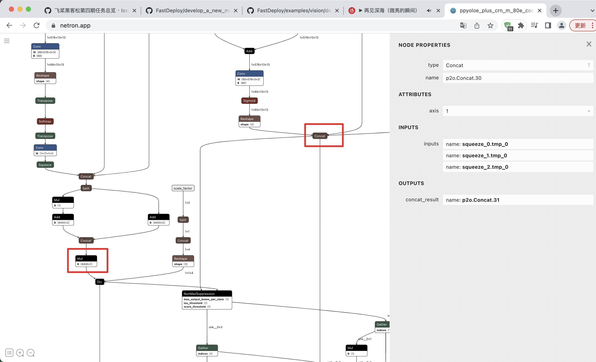

[English](README.md) | 简体中文

# PaddleDetection 地平线部署示例

## 支持模型列表

在Horizon上已经通过测试的PaddleDetection模型如下:

- PPYOLOE(float32)


## 准备PaddleDetection部署模型以及转换模型

Horizon部署模型前需要将Paddle模型转换成Horizon模型，具体步骤如下:

* Paddle动态图模型转换为ONNX模型，请参考[PaddleDetection导出模型](https://github.com/PaddlePaddle/PaddleDetection/blob/release/2.4/deploy/EXPORT_MODEL.md)
,注意在转换时请设置**export.nms=True**.
* ONNX模型转换Horizon模型的过程，请参考[转换文档](../../../../../docs/cn/faq/horizon/export.md)进行转换。

## 模型转换example

### 注意点

PPDetection模型在地平线上部署时要注意以下几点:

* 模型导出需要包含Decode
* 由于地平线不支持NMS，因此输出节点必须裁剪至NMS之前
* 由于地平线 Div算子的限制，模型的输出节点需要裁剪至Div算子之前

### Paddle模型转换为ONNX模型

由于地平线提供的模型转换工具暂时不支持Paddle模型直接导出为Horizon模型，因此需要先将Paddle模型导出为ONNX模型，再将ONNX模型转为Horizon模型。

```bash
# 以PP-YoloE+m为例
# 下载Paddle静态图模型并解压
wget https://bj.bcebos.com/fastdeploy/models/ppyoloe_plus_crn_m_80e_coco.tgz
tar xvf ppyoloe_plus_crn_m_80e_coco.tgz

# 静态图转ONNX模型，注意，这里的save_file请和压缩包名对齐
paddle2onnx --model_dir ppyoloe_plus_crn_m_80e_coco \
            --model_filename model.pdmodel \
            --params_filename model.pdiparams \
            --save_file ppyoloe_plus_crn_m_80e_coco/ppyoloe_plus_crn_m_80e_coco.onnx \
            --enable_dev_version True \
            --opset_version 11

# 固定shape
python -m paddle2onnx.optimize --input_model ppyoloe_plus_crn_m_80e_coco/ppyoloe_plus_crn_m_80e_coco.onnx \
                                --output_model ppyoloe_plus_crn_m_80e_coco/ppyoloe_plus_crn_m_80e_coco.onnx \
                                --input_shape_dict "{'image':[1,3,640,640], 'scale_factor':[1,2]}"
```
由于导出的ONNX IR Version和地平线不一致，因此，要手动更改ONNX IR Version，可参考以下Python代码，
```python
import onnx
model = onnx.load("ppyoloe_plus_crn_m_80e_coco/ppyoloe_plus_crn_m_80e_coco.onnx")
model.ir_version = 7
onnx.save(model, "ppyoloe_plus_crn_m_80e_coco/ppyoloe_plus_crn_m_80e_coco.onnx")
```
### 模型裁剪

由于Paddle2ONNX版本的不同，转换模型的输出节点名称也有所不同，请使用[Netron](https://netron.app)对模型进行可视化，并找到以下蓝色方框标记的NonMaxSuppression节点，红色方框的节点名称即为目标名称。

例如，使用Netron可视化后，得到以下图片:



找到NonMaxSuppression节点，可以看到红色方框标记的两个节点名称为p2o.Mul.290和p2o.Concat.29,因此需要将输出截止到这两个结点。
可以参考以下python代码，对输出进行剪裁，

```python 
import argparse
import sys


def parse_arguments():
    parser = argparse.ArgumentParser()
    parser.add_argument(
        '--model',
        required=True,
        help='Path of directory saved the input model.')
    parser.add_argument(
        '--output_names',
        required=True,
        nargs='+',
        help='The outputs of pruned model.')
    parser.add_argument(
        '--save_file', required=True, help='Path to save the new onnx model.')
    return parser.parse_args()


if __name__ == '__main__':
    args = parse_arguments()
    import onnx
    model = onnx.load(args.model)
    output_tensor_names = set()
    for node in model.graph.node:
        for out in node.output:
            output_tensor_names.add(out)

    for output_name in args.output_names:
        if output_name not in output_tensor_names:
            print(
                "[ERROR] Cannot find output tensor name '{}' in onnx model graph.".
                format(output_name))
            sys.exit(-1)
    if len(set(args.output_names)) < len(args.output_names):
        print(
            "[ERROR] There's dumplicate name in --output_names, which is not allowed."
        )
        sys.exit(-1)

    output_node_indices = set()
    output_to_node = dict()
    for i, node in enumerate(model.graph.node):
        for out in node.output:
            output_to_node[out] = i
            if out in args.output_names:
                output_node_indices.add(i)

    # from outputs find all the ancestors
    import copy
    reserved_node_indices = copy.deepcopy(output_node_indices)
    reserved_inputs = set()
    new_output_node_indices = copy.deepcopy(output_node_indices)
    while True and len(new_output_node_indices) > 0:
        output_node_indices = copy.deepcopy(new_output_node_indices)
        new_output_node_indices = set()
        for out_node_idx in output_node_indices:
            for ipt in model.graph.node[out_node_idx].input:
                if ipt in output_to_node:
                    reserved_node_indices.add(output_to_node[ipt])
                    new_output_node_indices.add(output_to_node[ipt])
                else:
                    reserved_inputs.add(ipt)

    num_inputs = len(model.graph.input)
    num_outputs = len(model.graph.output)
    num_nodes = len(model.graph.node)
    print(len(reserved_node_indices), "xxxx")
    for idx in range(num_nodes - 1, -1, -1):
        if idx not in reserved_node_indices:
            del model.graph.node[idx]
    for idx in range(num_inputs - 1, -1, -1):
        if model.graph.input[idx].name not in reserved_inputs:
            del model.graph.input[idx]
    for out in args.output_names:
        model.graph.output.extend([onnx.ValueInfoProto(name=out)])
    for i in range(num_outputs):
        del model.graph.output[0]

    from onnx_infer_shape import SymbolicShapeInference
    model = SymbolicShapeInference.infer_shapes(model, 2**31 - 1, True, False,
                                                1)
    onnx.checker.check_model(model)
    onnx.save(model, args.save_file)
    print("[Finished] The new model saved in {}.".format(args.save_file))
    print("[DEBUG INFO] The inputs of new model: {}".format(
        [x.name for x in model.graph.input]))
    print("[DEBUG INFO] The outputs of new model: {}".format(
        [x.name for x in model.graph.output]))

```
若将上述脚本命名为`prune_onnx_model.py`,则运行以下命令，对模型进行剪裁,

```bash
python prune_onnx_model.py --model ppyoloe_plus_crn_m_80e_coco/ppyoloe_plus_crn_m_80e_coco.onnx \
            --output_names p2o.Mul.290 p2o.Concat.29 \
            --save_file ppyoloe_plus_crn_m_80e_coco/ppyoloe_plus_crn_m_80e_coco_cut.onnx
```
至此，paddle2onnx部分完成，onnx模型转horizon模型的流程，可参考[导出模型指南](../../../../../docs/cn/faq/horizon/export.md)。

### 配置转换yaml文件

**修改normalize参数**

如果你需要在NPU上执行normalize操作，请根据你的模型配置normalize参数，例如:

```yaml
norm_type: 'data_scale'

  # the mean value minused by image
  # note that values must be seperated by space if channel mean value is used
  mean_value: ''

  # scale value of image preprocess
  # note that values must be seperated by space if channel scale value is used
  scale_value: 0.003921568627451
```

至此，模型转换完成，可直接在FastDeploy中进行部署。
## 其他链接

- [Cpp部署](./cpp)
- [视觉模型预测结果](../../../../../docs/api/vision_results/)
